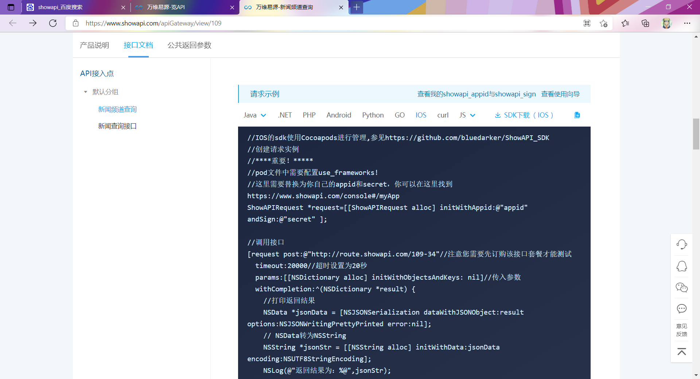
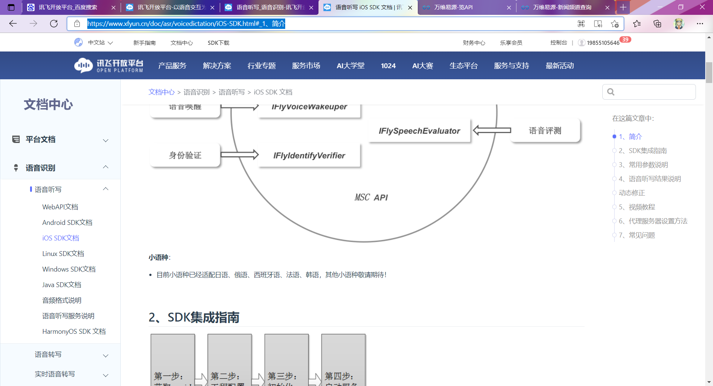
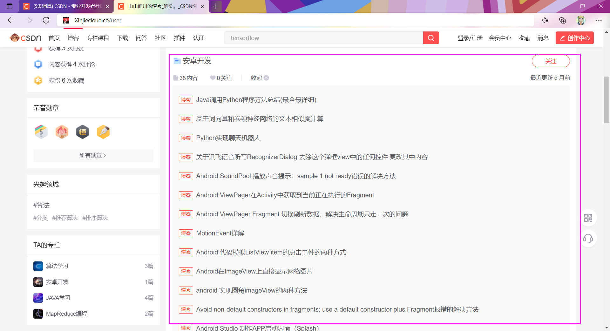

|-- README.md			说明文档
|-- Untitled.assets		本文档的图片文件夹（不用管）
|-- build						 编译后的目录（不用管）
|-- build.gradle			 gradle文件，ios不使用gradle
|-- gradle
|-- libs							讯飞语音识别和新闻接口的库文件
|-- local.properties
|-- msc.cfg
|-- speechDemo.iml
`-- src							源代码文件夹


新闻api：[万维易源-新闻频道查询 (showapi.com)](https://www.showapi.com/apiGateway/view/109)

```
appid:554224
appsecret:43a19f53dc9d4135974009d67d461daa
```




讯飞语音识别api：[语音听写_语音识别-讯飞开放平台 (xfyun.cn)](https://www.xfyun.cn/services/voicedictation)

ios文档：[语音听写 iOS SDK 文档 | 讯飞开放平台文档中心 (xfyun.cn)](https://www.xfyun.cn/doc/asr/voicedictation/iOS-SDK.html#_2、sdk集成指南)



、


由于讯飞语音识别sdk的移植一直有问题，因此本项目直接在讯飞官网下载的语音听写demo中进行修改，将官网下载的demo用不到的功能删除了，然后进行封装，在此基础上继续开发。有很多配置文件以及代码是原本sdk的代码，没有修改，不需要了解，我会在文件夹中注明。那些文件都是为了语音识别的，只要语音识别能成功跑通，就不用管了。


#### **建议开发流程：**

1、下载讯飞官网的语音识别demo，将语音识别跑通，只保留语音听写功能，把其他无用的代码都删除。跑通之后就把代码放那，先不用管了。

2、开发各个模块的功能，UI先不要去做太好看，做个最基本的UI就行。需要语音识别的地方（比如功能跳转、做笔记等）先用一个输入文本框+按钮代替，把各个模块先开发出来，先做个正常人用的软件（通过点击操作各个功能）。每个模块先做好，然后测试好。

3、写一个基类，把语音识别、语音播报等功能放在基类，然后将之前模块继承的类都换成这个基类，测试一下每个模块是否都能调用这些功能。

4、每个模块开发完后就可以开始做界面UI了。

5、合并模块然后测试。

6、细节优化


#### **tips：**

1、电子书与学四史模块：数据库的代码和文本处理的代码可以直接用我的代码逻辑，做一个基本的展示效果和翻页效果。

2、新闻模块：先将新闻api的IOS代码跑通，不要做推荐模块和本地新闻模块，就做一个普通的新闻模块，可以看各个主题的新闻，我在开发的时候，推荐模块和本地新闻模块都是锦上添花的操作。

3、笔记模块：各种细节先不要考虑，先把做笔记整套流程开发出来，用两个button代替做笔记和删除最后一句话。先实现基本的最笔记和删除句子的功能，后期再继续优化。

4、笔记列表：先做一个能展示所有笔记的界面，以及能通过点击操作进入某个笔记，其他操作后期优化。

5、电台模块：先在一个界面上展示出所有电台，点一下可以播放，再点一下可以暂停。前期实现一个这样基本的功能就可以了。其他的后期慢慢优化。

6、学习模块：先把爬虫的代码移植过去，将新闻先爬取下来，再考虑如何展示。学四史在第一点就说了。


#### **所有模块开发完成后需要做的事情：**

1、先将所有的通过按钮或者点击操作的功能，转化成通过语音控制转化，也就是通过语音控制的回调函数，来完成各个功能。

2、实现手势识别，重写界面控件的事件，当点击屏幕的时候不能操作控件。实现手势的检测，如上滑，下滑，单击，长按等。将各个手势绑定到不同的函数，比如下滑选择下一个电台，上滑选择上一个电台，点击屏幕播放当前电台，长按屏幕唤出语音识别。

3、把之前的所有细节都完善一下。

4、实现语音播报功能，播报新闻，播报电子书，播报笔记等等。。。。以及播报当前所处的位置，进入一个模块后就通过语音播报当前的位置，让用户知道自己进入了这个模块，否则用户不知道自己目前在什么模块

5、实现一些提示音，比如删除笔记提示音、笔记保存提示音、笔记标题修改提示音、没听懂用户的意图的提示音等等。。。。

6、将各个模块之间的切换通过语音识别完成，也就是实现判断用户意图的代码（可以和我一样用很多的if else 语句）


#### 建议的代码阅读顺序：

base

main

radio

ebook与utils

study

news


**代码里的难点：**

ListView的适配器及其原理

ViewPager的适配器及其原理

碎片的含义以及使用

重写手势识别

笔记模块的各种复杂的逻辑

数据库的一些操作


我参考的博客：

[山山而川的博客_解矣。_CSDN博客-JAVA学习,算法学习,MapReduce编程领域博主](https://blog.csdn.net/qq_44939973?type=collect)



收藏夹里的安卓开发，这些是我在开发过程中参考的一些文档，可能还有的参考的没有收藏。


还有一篇是我自己写的手势识别的博客

[安卓OnTouchListener长按事件，上滑事件，下滑事件](https://blog.csdn.net/qq_44939973/article/details/115001602)


其中有几个代码文件编写的太乱太复杂，因此在代码里没写多少注释，所以单独写了一个文档来说明那几个文件，在函数文档.md中。阅读到那一部分代码的时候再去看。


所有代码基本都写了注释，有的代码写的很烂，很不规范，如果有不懂或疑惑的地方请QQ联系我。QQ：516363082
