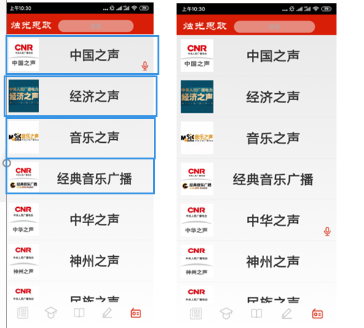

|-- domain			存放一些适配器文件和与新闻接口读取有关的JavaBean文件
|-- ise					讯飞sdk文件
|-- **myapp**			app各个模块文件（主要）
`-- speech			讯飞sdk文件

适配器是一种安卓布局ListView的支撑文件，ListView就是相当于手机设置中一行一行的那种，每行可以有图片或一些文字

像这样的就是ListView，有多少需要展示就有多少行。今日头条那种新闻，一条一条的也是差不多的样子。

domain下的videoView是展示开机动画的，直接在csdn复制下来的代码。MyImageView是一个自定义的可以通过网络URL展示图片的ImageView，也是直接从csdn上复制下来的。安卓自带的ImageView只能通过本地URI展示图片，但是新闻的图片都是通过一个URL访问，所以自定义一个可以直接通过URL展示图片的控件非常方便。