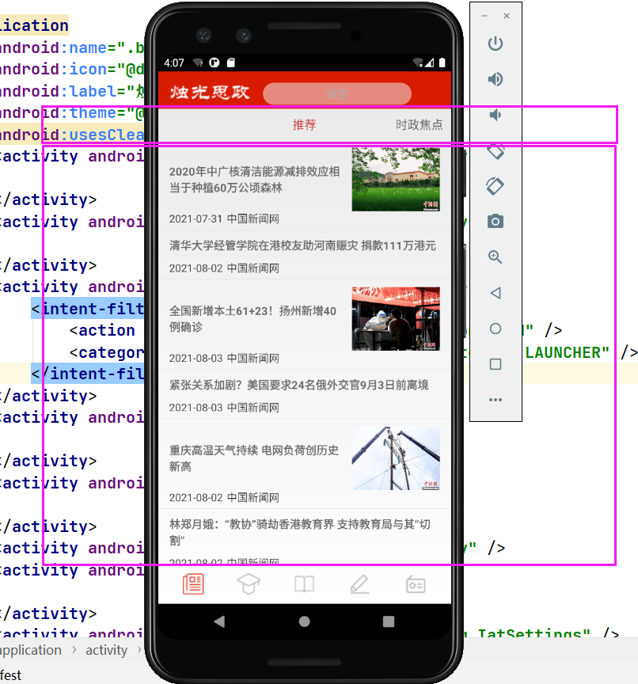

|-- **base**				自定义的基类，封装许多功能，减少重复代码编写
|-- ebook			  电子书的活动
|-- main				主活动（开机活动）
|-- news				新闻活动
|-- notebook		笔记活动
|-- radio				听电台活动
|-- study				学习活动（学四史）
`-- utils				  数据库工具

base：

|-- BaseActivity.java				
|-- BaseFragment.java
`-- SpeechApp.java			程序主入口，讯飞自带

安卓有两种活动，一种是基本活动，一种是碎片，基本活动就是整页屏幕就是一个活动，而碎片就是比如上方有一个导航栏，然后点击导航栏上的各个模块，下面一部分就会跟着切换。这两种是继承自不同的类，因此需要自定义两种基类。

这就是个碎片，点击上面的时政焦点，下面就会转到时政焦点的新闻界面。整个界面是一个activity，但是下面的推荐新闻，时政焦点新闻等等，都是一个个碎片。

由于本项目是给视障人群使用的，因此会大量使用到语音播报，语音识别等功能，因此在一个基类中将所有的基本功能写好，以后所有的类都继承自这个基类，那就可以很方便的调用这些功能，也不需要重复写代码了。

BaseActivity和FragmentActivity里的内容几乎是完全一样的。包含的功能有：

- 语音识别函数：`getSpeechRecognizer()`，调用这个函数就能唤出语音识别，语音识别的结果保存到全局变量`SPEECH_RESULT`中。
- 文本阅读函数：`readText(String text)`，调用这个函数就能阅读text中的文本内容。
- 提示音播放函数：`playSound(int musicId)`，调用这个函数就能播放id为musicId的提示音

其他函数我会在代码中注明