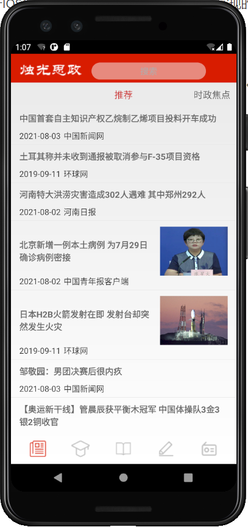

这些文件写的非常乱，非常复杂，由于IOS与安卓开发不一样，因此直接看怎么实现的，不要去看源代码。

# MainNewsList.java

这个文件能实现听新闻下的所有功能，包括各个类别的新闻展示，以及本地新闻展示。这个文件还实现了学四史模块的推荐一栏的展示，因为他们的格式都差不多，都是一条一条的内容，所以放在一个文件里实现了。



上面的推荐和时政焦点等等都是导航栏，下面的新闻内容是导航栏对应的新闻。这些新闻是通过之前那个文档中的接口获取的，返回的事一个json文件，里面有指定数量的新闻。然后将每条新闻提取出来，放进这个ListView的每一项中，就能实现这个效果。滑动的效果是通过安卓里的一个控件，叫做viewPager实现的。

我讲一下安卓的实现原理，IOS实现原理不清楚。

```java
List<Fragment_News_List> fragments = new ArrayList<>();
fragments.add(Fragment_News_List.newInstance("推荐"));
fragments.add(Fragment_News_List.newInstance("时政焦点"));
fragments.add(Fragment_News_List.newInstance("科技焦点"));
fragments.add(Fragment_News_List.newInstance("军事焦点"));
fragments.add(Fragment_News_List.newInstance("国际焦点"));
fragments.add(Fragment_News_List.newInstance("港澳台最新"));
String province = getSharedPreferences("message", MODE_PRIVATE).getString("province", "安徽");
fragments.add(Fragment_News_List.newInstance("#" + province));
adapter = new FragAdapter(this, getSupportFragmentManager(), fragments);
viewPager.setAdapter(adapter);
titleList = new ArrayList<>();
titleList.add("推荐");
titleList.add("时政焦点");
titleList.add("科技焦点");
titleList.add("军事焦点");
titleList.add("国际焦点");
titleList.add("港澳台最新");
titleList.add(province);
```

首先创建了一个fragments数组，这个数组包含的内容就是一个个的碎片活动，碎片活动就是上图中的推荐下面的新闻，或者时政焦点下面的新闻。`fragments.add(Fragment_News_List.newInstance("推荐"));`的意思就是向这个数组中添加一个碎片，然后向这个碎片传递的内容是推荐，或时政焦点，或科技焦点。。。等等。传递的这个内容会在碎片的那个代码文件中被接收，通过这个来判断当前碎片展示的是什么类型的新闻，以此从服务器获取某个类型的新闻。当然那都是另一个碎片类干的事情了。然后创建一个adapter，这是一个适配器，代码直接从网上复制的。最后将这个适配器与viewPager关联起来，就能实现左右滑动，切换碎片的效果了。这些工作都不难，网上很容易找到demo，修改一下就行。对于我来说，最难的部分是通过手势控制代码的执行，需要重写所有的手势动作函数，然后通过触摸屏幕和离开屏幕的坐标，来判断用户是向上还是向下切换。


# FragmentNewsList.java

这个文件就是碎片文件，通过上面文件中的代码`fragments.add(Fragment_News_List.newInstance("推荐"));`就能创建一个这个文件中的类，添加进fragments中。并且还能将推荐传递到这个文件中接收，以此判断该推荐新闻给用户还是将对应的主题的新闻展示给用户，或者是展示本地新闻。在这个类中分别实现了四种新闻展示，分别是推荐、主题新闻、本地新闻、习近平讲话。前三种都是新闻模块下的子模块，第四种是学四史模块下的推荐模块，在网络上的一个数据库中抓取讲话，并在手机上展示。因为这几个都是一种类型碎片，一次我放到一起去了。


- 习近平讲话模块的实现：

```
String[] urls = {
        "http://jhsjk.people.cn/result?form=702&else=501",  //"重要活动"
        "http://jhsjk.people.cn/result?form=701&else=501",  //"重要会议"
        "http://jhsjk.people.cn/result?form=703&else=501",  //"重要考察"
};
```

上面三个URL是这个数据库的网址，通过爬虫获取每个类型下的讲话标题与URL，并将标题与内容的URL通过一个类关联起来，用户点击这条讲话，就通过这个URL获取其中的内容，然后放给用户听。


- 推荐模块实现：

记录用户历史阅读的各个主题新闻的次数，然后去请求最新的新闻，每个主题都请求20条或30条，然后按照比例从中随机取出新闻，然后随机打乱，推荐给用户。

- 各个主题的新闻

通过之前那个类传递的信息判断传递的是哪类新闻，然后通过新闻接口去获取一定数量的新闻，展示到界面上。

- 本地新闻

本地新闻的获取方法在showapi的官网上也有，但是需要一个文本抽取接口。那个接口提供了每个新闻的URL，但是内容和标题没有直接提取出来给我们用，但他们提供了一个新闻抽取接口，通过URL可以直接抽取出新闻的标题的和内容，将这两个结合起来使用，然后将结果展示到界面上。


这个文件代码看起来非常多，实际上一半是在手势控制，一半是在新闻的获取与展示。我建议可以重新写一个工具类，来专门处理新闻，不要跟我这个一样堆在一起，非常乱，并且看不下去，不好维护。


# MainStudyActivity.java

这个类的作用与MainNewsList.java类似，都是是一个包含了很多个碎片的类，实现原理也一致。这个类包含的第一个碎片是FragmentNewsActivity，其他几个碎片都是FragmentStudyList。

# FragmentStudyList.java

这个是学习模块的碎片，比新闻模块简单，因为不需要从网络获取什么东西，所有的文本都已经提前创建在数据库中。因此大多数都是数据库的操作，很容易明白。其中有一半的代码也是在控制手势的动作。